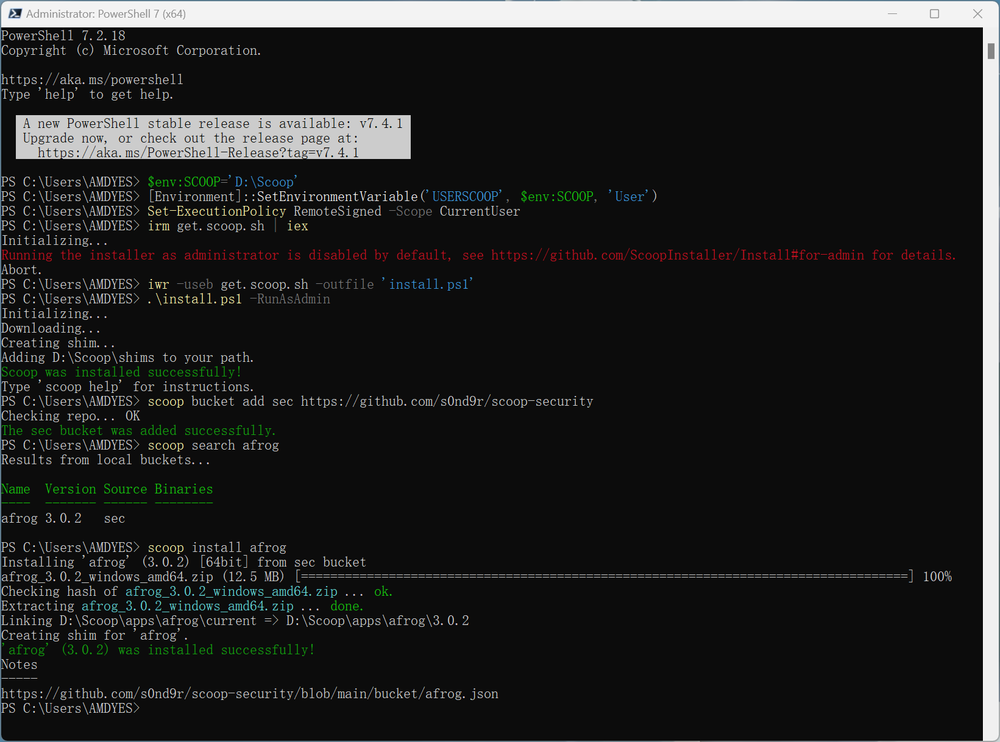

<div align="center">
    <h1 align="center">scoop-security</h1>
    <p align="center">
        Scoop bucket for Penetration Testing and Cybersecurity related tools
    </p>
</div>

## Scoop 安装

- 打开 PowerShell
- 允许 PowerShell 执行本地脚本

```powershell
Set-ExecutionPolicy RemoteSigned -Scope CurrentUser
```

- 通过以下命令，可以将Scoop安装到默认目录（`C:\Users\<username>\scoop`）：

```powershell
Invoke-Expression (New-Object System.Net.WebClient).DownloadString('https://get.scoop.sh')

# 或者用这一条更短的命令
iwr -useb get.scoop.sh | iex
```

- 如果你需要更改默认的安装目录，则需要在执行以上命令前添加环境变量的定义，通过执行以下命令完成：

```powershell
$env:SCOOP='D:\Scoop'
[Environment]::SetEnvironmentVariable('SCOOP', $env:SCOOP, 'User')

iwr -useb get.scoop.sh | iex
```

- 设置允许 PowerShell 执行本地脚本

```powershell
Set-ExecutionPolicy RemoteSigned -Scope CurrentUser
```

- **错误解决**：无法以`administrator`运行

```powershell
PS C:\Users\CIA0CIA0> irm get.scoop.sh | iex 
Initializing... 
Running the installer as administrator is disabled by default, see https://github.com/ScoopInstaller/Install#for-admin for details.                                                             Abort.
```

更换安装命令:

```powershell
iwr -useb get.scoop.sh -outfile 'install.ps1'
.\install.ps1 -RunAsAdmin
```

> Scoop的软件仓库通常都放在Github上，如果你的电脑无法直接访问，可以考虑设置代理访问
>
>
> - 设置Scoop代理
>
> ```powershell
> scoop config proxy 127.0.0.1:7890
> ```
> 
> - 恢复使用系统代理
> 
> ```powershell
> scoop config rm proxy
> ```


- 卸载 Scoop

```powershell
scoop uninstall scoop
```


## Scoop 配置


- 添加自定义软件bucket

Scoop 默认软件仓库（main bucket）软件数量是有限，通常我们需要安装三方bucket，执行以下命令订阅本软件仓库：

```powershell
scoop bucket add security https://github.com/s0nd9r/scoop-security
```

- 查找软件

```
scoop search nuclei
```

- 安装本仓库的软件：

```
scoop install security/<软件名>
```

大多数情况下，是可以省略 `security/`，只需要执行类似 `scoop install nuclei` 的命令

- 查看已安装的程序

```
scoop list
```

- 查看哪些程序可以升级

```
scoop status
```

- 更新 scoop

```
scoop update
```

- 更新 app

```
scoop update 7zip
```

- 更新 scoop、bucket、app

```
scoop update *
```

- 卸载软件

```
scoop uninstall 7zip
```

- 一次性卸载多个软件

```
scoop uninstall 7zip typora
```


> 通常本仓库每隔几个小时会自动更新所有软件到最新版本，也可以在本地手动检查软件是否更新新版本
>
> - 尝试更新软件版本
>
> ```powershell
> cd D:\Scoop\buckets\security
> .\bin\checkver.ps1 xray
> ```
>
> - 存在新版本时，可下载并更新软件hash值
>
> ```powershell
> .\bin\checkver.ps1 xray -u
> ```
>
> 通过查看security\buckets下的该json文件已被更新





更多关于Scoop的信息，请阅读[ScoopInstaller/Scoop](https://github.com/ScoopInstaller/Scoop)的wiki界面


## Featured Apps

| Manifest        | Description                                                  |
| --------------- | ------------------------------------------------------------ |
| afrog           | afrog 是一款性能卓越、快速稳定、PoC 可定制化的漏洞扫描工具 - A tool for finding vulnerabilities |
| antsword-loader | AntSword 加载器                                              |
| behinder        | “冰蝎”动态二进制加密网站管理客户端                           |
| blueteamtools   | 蓝队分析研判工具箱，功能包括内存马反编译分析、各种代码格式化、网空资产测绘功能、溯源辅助、解密冰蝎流量、解密哥斯拉流量、解密Shiro/CAS/Log4j2的攻击payload、IP/端口连接分析、各种编码/解码功能、蓝队分析常用网址、java反序列化数据包分析、Java类名搜索、Fofa搜索、Hunter搜索等。 |
| dddd            | 一款高可拓展的指纹识别、供应链漏洞探测工具。支持从Hunter、Fofa批量拉取目标。 |
| fscan           | 一款内网综合扫描工具，方便一键自动化、全方位漏扫扫描。       |
| godzilla        | 哥斯拉                                                       |
| httpx           | httpx is a fast and multi-purpose HTTP toolkit that allows running multiple probes using the retryablehttp library. It is designed to maintain result reliability with an increased number of threads |
| kscan           | Kscan 是一款纯 go 开发的全方位扫描器，具备端口扫描、协议检测、指纹识别，暴力破解等功能。支持协议 1200+，协议指纹 10000+，应用指纹 2000+，暴力破解协议 10 余种。 |
| ksubdomain      | Subdomain enumeration tool, asynchronous dns packets, use pcap to scan 1600,000 subdomains in 1 second |
| mdut            | MDUT - Multiple Database Utilization Tools                   |
| naabu           | projectdiscovery/naabu: A fast port scanner written in go with a focus on reliability and simplicity. Designed to be used in combination with other tools for attack surface discovery in bug bounties and pentests |
| notify          | Notify is a Go-based assistance package that enables you to stream the output of several tools (or read from a file) and publish it to a variety of supported platforms |
| nuclei          | Fast and customizable vulnerability scanner based on simple YAML based DSL |
| scan4all        | Vulnerabilities Scan；15000+PoC漏洞扫描；[ 23 ] 种应用弱口令爆破；7000+Web指纹；146种协议90000+规则Port扫描；Fuzz、HW打点、BugBounty神器... |
| xray            | 一款完善的安全评估工具，支持常见 web 安全问题扫描和自定义 poc |
| suo5            | 一款高性能 HTTP 代理隧道工具                                 |
| xpoc            | xpoc 为供应链漏洞扫描设计的快速应急响应工具                  |
| yakit           | Cyber Security ALL-IN-ONE Platform                           |


在线查看仓库列表[s0nd9r/scoop-security](https://scoop.sh/#/apps?q=%22https%3A%2F%2Fgithub.com%2Fs0nd9r%2Fscoop-security%22&o=false&n=true&dm=false)

## Question
**1. I want some other apps!**

Please open new app request [issue](https://github.com/s0nd9r/scoop-security/issues) :)

Please consider submitting your new app pull requests to the official buckets if
they satisfy the criteria before opening new app request in my bucket.


## Thanks
- [ScoopInstaller/Scoop: A command-line installer for Windows.](https://github.com/ScoopInstaller/Scoop)

- [ViCrack/scoop-bucket: The free bucket for Scoop](https://github.com/ViCrack/scoop-bucket)
